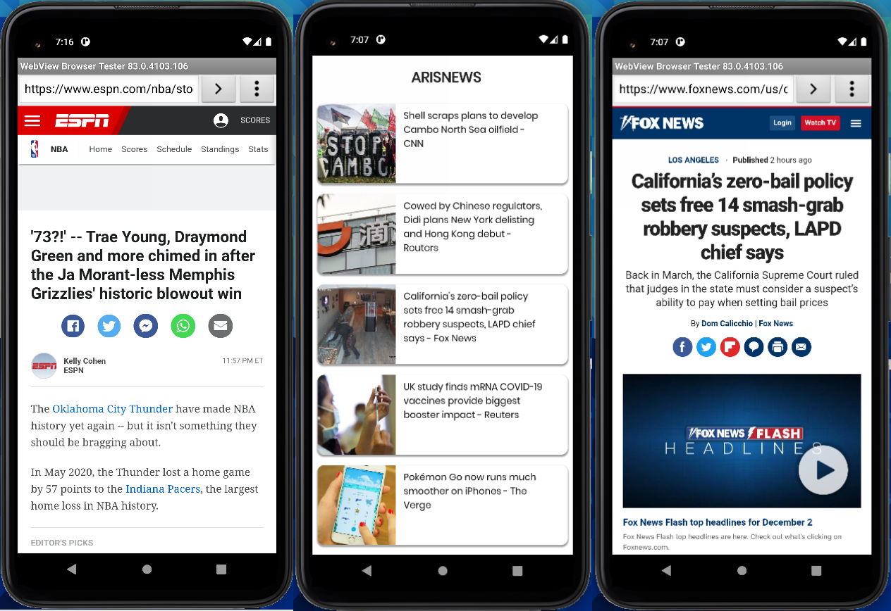

<h1 align="center">Aris News</h1>

<br />
 
<p align="center">
  
  
</p>

<br />




## Getting Started

```dart
$ git clone https://github.com/ariscybertech/aris_map.git
$ flutter packages get
```

Run the application and enjoy :tada: :rainbow:

<a href="https://www.buymeacoffee.com/ariscybertech"></a>

ArisNews is the award-winning news app downloaded by 40+ million readers in 100+ countries!

ArisNews analyzes millions of articles every day to deliver the top trending news stories influencing the world right now.

ArisNews delivers high-quality news headlines and breaking news from top news publishers: NBC News, MSNBC, USA Today, TIME, The Huffington Post, Bleacher Report, Quartz, The Verge, VICE, VOX, AP, Reuters, Buzzfeed, Fast Company and more.

***

“Browse headlines quickly, customize your channels and read the news offline. ArisNews is an excellent free alternative to other popular news apps.”
- CNET

***

Breaking News --
Notifications for breaking news headlines.

Smart Mode --
Readability mode for optimal news reading experience.

Offline News Reading --
Fetch trending news and read it offline.
